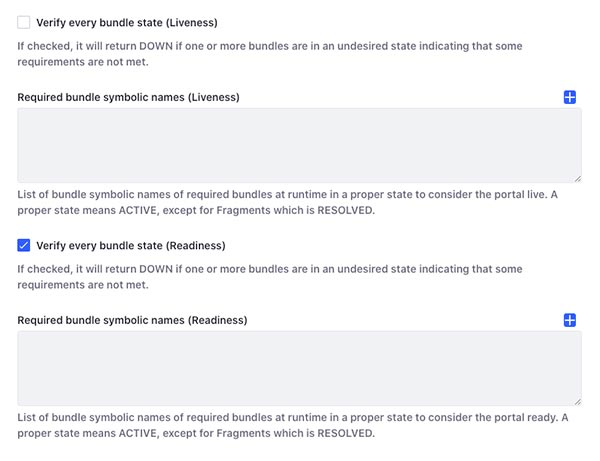

# Liferay Health Check

A configurable API to help you expose more accurate readiness and liveness probes. 

Inspired by the [healthcheck-servlet](https://github.com/allen-ziegenfus/healthcheck-servlet) from [Allen Ziegenfus](https://github.com/allen-ziegenfus). 

- [How it works](#how-it-works)
- [Installation](#installation)
- [Configuration](#configuration)
- [How to implement a custom health check](#how-to-implement-a-custom-health-check)
- [Quickly try it](#quickly-try-it)
- [Contribution & questions](#contribution--questions)

## How it works

Once this JAR installed under `$LIFERAY_HOME/osgi/modules`, it will provide you two endpoints:

- `/o/health/readiness`
- `/o/health/liveness`

Those JAX-RS endpoints are available once Liferay is ready to accept connections, so basically when you see `Server startup in [xx,xxx] milliseconds` in the logs.

So why using those endpoints instead of just waiting for `/c/portal/layout/` to be available?
 
First, because you may have some modules still starting up afterwards, in which case your Liferay instance is not ready yet.

Second, because the readiness and liveness of an application are different states.
So here we have two different endpoints for the `readiness` probe and the `liveness` probe and each one can be configured to properly reflect those states.

## Installation

Install the JAR under `$LIFERAY_HOME/osgi/modules`. You'll find two versions for Java 8 & 11 in the [releases section](https://github.com/lgdd/liferay-healthcheck/releases).

⚠️ Do not use `$LIFERAY_HOME/deploy`: the deploy folder is scanned just before Liferay startup which could raise a `404` on those endpoints because the module is not installed yet.
Using osgi/modules allows Liferay to install the module when you see `Starting dynamic bundles` in the logs.

## Configuration

Go to `Control Panel > System Settings > Third Party > Health Check` and adjust the following parameters according to your needs:



You can see that we have two main parameters: `Verify every bundle state` and `Required bundle symbolic names`.
They are duplicated in order to define separately the behaviour of the `readiness` probe and `liveness` probe.

- __Verify every bundle state__: it will perform an equivalent to [`dm:wtf`](https://github.com/apache/felix-dev/blob/master/dependencymanager/org.apache.felix.dependencymanager.shell/src/org/apache/felix/dm/shell/DMCommand.java#L551) (Where's The Failure) and determine if one or more OSGi bundles are in an undesired state.
The desired state is either `ACTIVE` or `RESOLVED` for OSGi Fragments.
- __Required bundle symbolic names__: it will specifically look for the bundles defined by symbolic names and check if they are present and in a desired state.
Checking `Verify every bundle state` is not enough to do that since you can have bundles waiting to be installed and just not present in the list of bundles.
It also checks or if a custom component implementing [`HealthCheckService`](https://github.com/lgdd/liferay-healthcheck/blob/master/src/main/java/com/github/lgdd/liferay/health/api/HealthCheckService.java) returns `DOWN`.
This allows you to provide your own definition of readiness and liveness for a given bundle. 

## How to implement a custom health check

As mentioned in the previous section, you can implement your own [`HealthCheckService`](https://github.com/lgdd/liferay-healthcheck/blob/master/src/main/java/com/github/lgdd/liferay/health/api/HealthCheckService.java).

You have to add the dependency:

Maven:
```
<dependency>
  <groupId>com.github.lgdd</groupId>
  <artifactId>liferay-healthcheck</artifactId>
  <version>1.1.2</version>
  <scope>provided</scope>
</dependency>
```

Gradle:
```
compileOnly group: 'com.github.lgdd', name: 'liferay-healthcheck', version: '1.1.2'
```

*Note: The scope is `provided` / `compileOnly` because you should deploy this dependency in Liferay and making it available at runtime.*

And create a new class with the following structure:

```
import com.github.lgdd.liferay.health.api.HealthCheckService;

@Component(
    immediate = true,
    service = HealthCheckService.class
)
public class MyHealthCheck
    implements HealthCheckService {

  @Override
  public HealthCheckResponse isReady() {

    // Add your custom code to verify the health
    // and adjust the response below accordingly

    return HealthCheckResponse.builder()
                              .status(HealthCheckStatus.UP)
                              .message("Everything is awesome")
                              .build();
  }

  @Override
  public HealthCheckResponse isLive() {

    // Add your custom code to verify the health
    // and adjust the response below accordingly

    return HealthCheckResponse.builder()
                              .status(HealthCheckStatus.DOWN)
                              .message("Something's wrong I can feel it")
                              .issues(issues)
                              .build();
  }
}
```

## Quickly try it

- Clone this repo
- Run `docker-compose up --build`
- Once the Liferay docker container, you can run `curl http://localhost:8080/o/health/readiness`

Now, you can deploy some bundles and change the configuration to test the different responses you can get from `http://localhost:8080/o/health/readiness` or `http://localhost:8080/o/health/liveness`.

If you want to update this code and test it within the Liferay container you just launched, simply run `./gradlew assemble` or `./gradlew -t assemble` to enter in watch mode.
> You may need to add `-PsonatypeUsername -PsonatypePassword` to the command.

Admin credentials are the default ones: `test@liferay.com:test`. 

## Contribution & questions

Feel free to [open issues](https://github.com/lgdd/liferay-healthcheck/issues/new) or [pull requests](https://github.com/lgdd/liferay-healthcheck/compare) to help me improve this application.

## License

[MIT](LICENSE)
